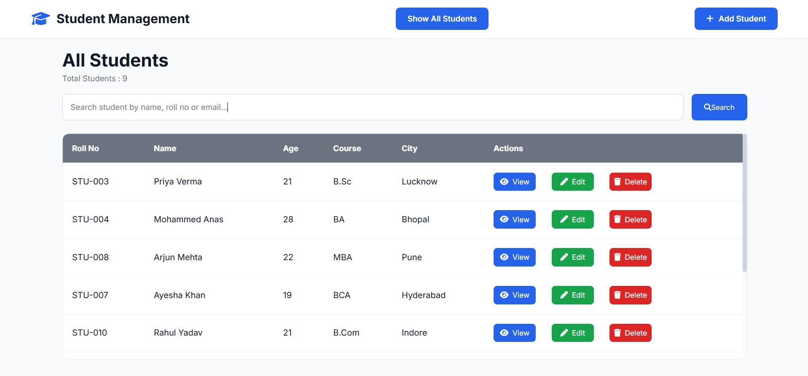
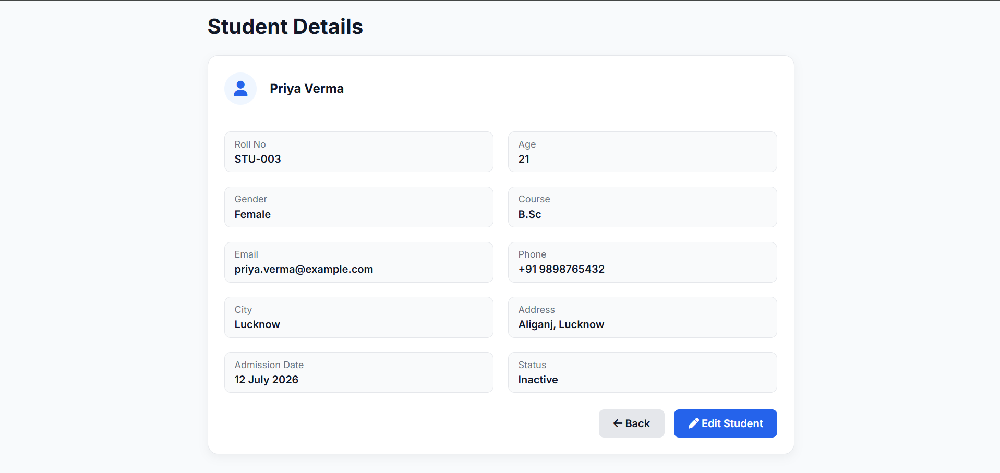
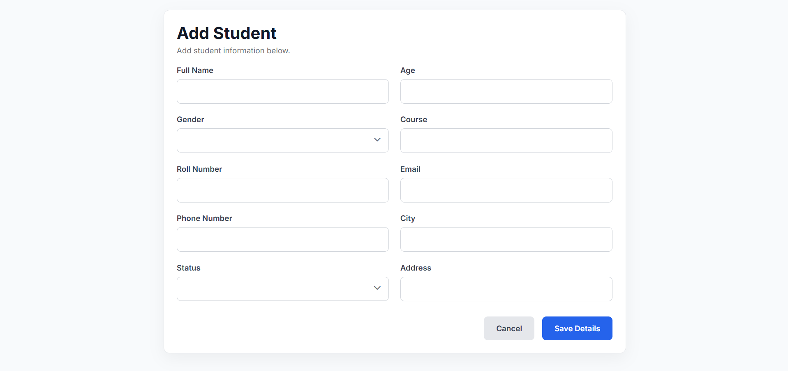
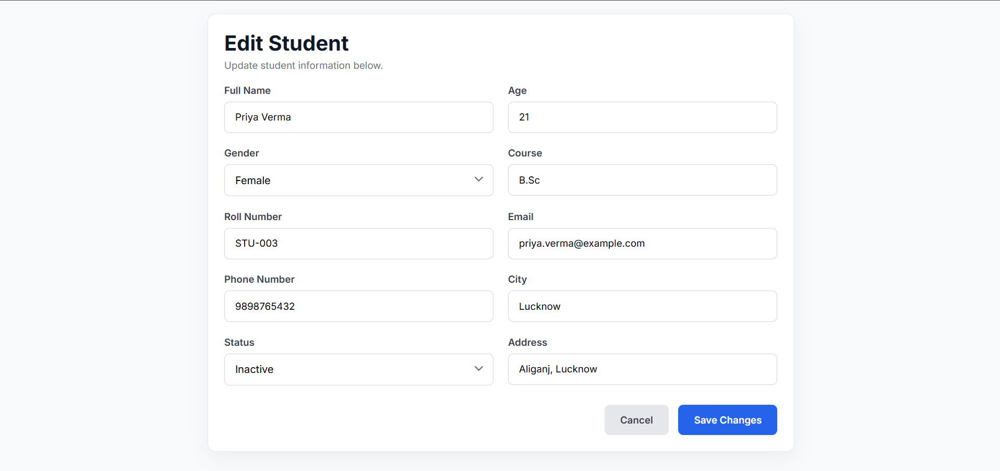
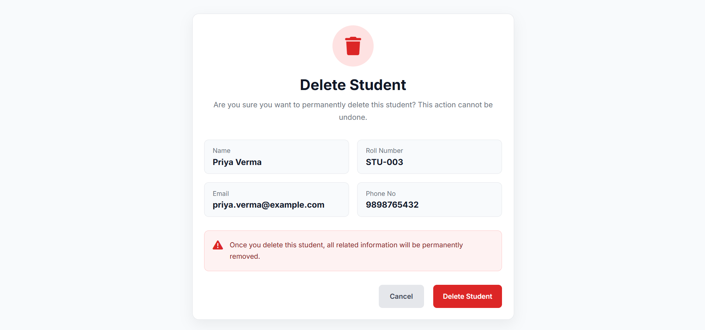

# 🎓 Student Management System

**Version:** v2.0.0

A full-stack **Student Management System** built with **Node.js, Express.js, MySQL, EJS, UUID, and Method Override**. This project demonstrates the fundamentals of **REST APIs, CRUD Operations, MySQL Integration, Search Functionality, and Server-Side Rendering** using Express.

---

## 🚀 Features

- ➕ Add New Student
- 📋 View All Students
- 👀 View Student Details
- ✏️ Edit Student Information
- 🗑️ Delete Student
- 🔍 Search Students by Name, Roll Number & Email
- 🆔 UUID-based Student IDs
- 🗄️ MySQL Database Integration
- 📄 SQL Schema Included
- 🔐 Environment Variables (.env)
- 🌐 RESTful Routing
- 🔄 Method Override for PATCH & DELETE Requests
- 🖥️ Server-Side Rendering with EJS
- 📱 Responsive User Interface

---

## 🛠️ Tech Stack

- Node.js
- Express.js
- MySQL
- mysql2
- EJS
- UUID
- Method Override
- Dotenv
- HTML5
- CSS3
- JavaScript

---

## 📁 Project Structure

```text
student-management-system/
│
├── public/
│   ├── style.css
│   ├── view.css
│   ├── edit.css
│   └── delete.css
│
├── views/
│   ├── index.ejs
│   ├── view.ejs
│   ├── new.ejs
│   ├── edit.ejs
│   └── delete.ejs
│
├── server/
│   ├── schema.sql
│   └── seed.js
│
├── .env
├── .gitignore
├── index.js
├── package.json
├── package-lock.json
└── README.md
```

## 📌 REST API Routes

| Method | Route | Description |
|--------|-------|-------------|
| GET | /student | Display all students |
| GET | /student/new | Show Add Student Form |
| POST | /student | Add New Student |
| GET | /student/:id | View Student Details |
| GET | /student/:id/edit | Show Edit Student Form |
| PATCH | /student/:id | Update Student |
| GET | /student/:id/delete | Show Delete Confirmation |
| DELETE | /student/:id | Delete Student |

---

## 🔍 Search Functionality

Search students by:

- Name
- Roll Number
- Email

Example:

```
/student?search=Anas
```

The application filters matching students and displays the search results.

---

## 🔐 Environment Variables

Create a **.env** file in the project root.

```env
DB_HOST=localhost
DB_USER=root
DB_PASSWORD=your_password
DB_NAME=student_management
PORT=3000
```

---

## ⚙️ Installation

### 1. Clone the repository

```bash
git clone https://github.com/mdanas5221/student-management-system.git
```

### 2. Navigate to the project folder

```bash
cd student-management-system
```

### 3. Install dependencies

```bash
npm install
```

### 4. Create a .env file

```env
DB_HOST=localhost
DB_USER=root
DB_PASSWORD=your_password
DB_NAME=student_management
PORT=3000
```

### 5. Create the database

```sql
CREATE DATABASE student_management;
```

### 6. Run the schema file

```bash
source schema.sql
```

### 7. (Optional) Seed the database

```bash
node seed.js
```

### 8. Start the server

```bash
node index.js
```

or

```bash
nodemon index.js
```

### 9. Open your browser

```
http://localhost:3000/student
```

---

## 📚 What I Learned

- Express.js Routing
- CRUD Operations
- REST API Principles
- MySQL Integration
- SQL Queries
- Placeholder Queries
- Route Parameters (`req.params`)
- Query Parameters (`req.query`)
- Express Middleware
- EJS Templating
- Form Handling
- Search Functionality
- UUID
- Method Override
- Environment Variables (.env)
- Database Seeding
- Server-Side Rendering
- Dynamic Routing

---

## 🎯 Future Improvements

- 🔍 Live Search (Without Page Reload)
- 🔐 Authentication & Authorization
- 👤 Student Profile Image Upload
- 📊 Dashboard & Analytics
- 📄 Pagination
- ↕️ Sorting & Filtering
- 💬 Flash Messages
- ⚠️ Better Error Handling
- 📤 Export Data (CSV / PDF)
- 👥 Role-Based Access Control

---

## 📷 Screenshots

### 🏠 Home



### 👥 Student List



### ➕ Add Student



### ✏️ Edit Student



### 🗑️ Delete Student



---

## 👨‍💻 Author

**Md Anas**

GitHub: https://github.com/mdanas5221

---

## ⭐ Support

If you found this project helpful, consider giving it a ⭐ on GitHub.